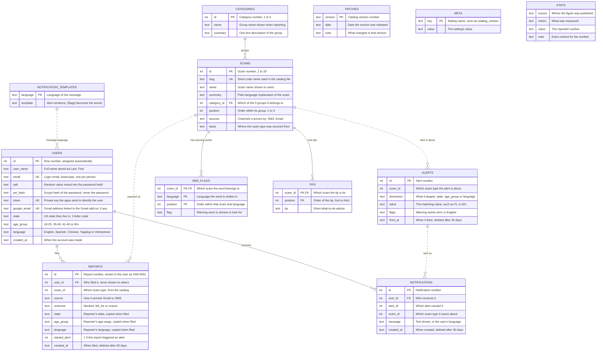

# SwivProtect: detailed entity relationship diagram

Every column carries a plain-English description.

Two SQLite files, joined by the server on one connection:

- `data/live.db` changes constantly: `USERS`, `REPORTS`, `ALERTS`, `NOTIFICATIONS`.
- `data/catalog.db` is static reference data built from `data/catalog.json`: everything else.

Solid lines are enforced foreign keys. Dashed lines are logical links that SQLite does not enforce.

